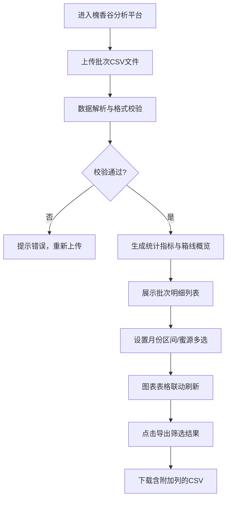

## 1. 产品概述

城郊蜂场「槐香谷」蜂蜜批次质量分析平台，帮助蜂场管理者快速上传 CSV 批次数据，按蜜源维度对比酸度与含水量分布，自动判定可上架批次，支持多维筛选与结果导出。

- 目标用户：蜂场质量管理人员、生产运营负责人
- 产品价值：将蜂蜜批次质检数据从手工 Excel 分析转为可视化交互平台，提升质量管控效率

## 2. 核心功能

### 2.1 功能模块

1. **数据上传页**：CSV 文件拖拽/点击上传、格式校验、数据预览
2. **分析概览页**：蜜源分组箱线概览（酸度/含水量）、分位数统计表、批次总量看板
3. **批次列表页**：批次明细表格、可上架/待复检状态标签、筛选联动
4. **筛选控制条**：采蜜月份区间筛选、蜜源多选筛选
5. **导出模块**：导出当前筛选结果 CSV，附加「可上架」「待复检原因」列

### 2.2 页面详情

| 页面名称 | 模块名称 | 功能描述 |
|-----------|-------------|---------------------|
| 分析主页 | 顶部导航栏 | 品牌标识「槐香谷」、上传按钮、导出按钮 |
| 分析主页 | 数据上传区 | 拖拽上传 CSV、格式说明提示、示例数据下载 |
| 分析主页 | 筛选控制条 | 采蜜月份区间（起止月份）、蜜源多选复选框 |
| 分析主页 | 指标看板 | 总批次数、可上架数、待复检数、各蜜源批次占比 |
| 分析主页 | 箱线概览区 | 酸度箱线图分组对比、含水量箱线图分组对比、分位数表格 |
| 分析主页 | 批次明细表 | 全部字段展示、状态高亮、分页浏览 |

## 3. 核心流程

用户进入平台 → 上传 CSV 批次文件 → 系统解析并校验数据 → 展示分组箱线概览与统计指标 → 用户通过月份/蜜源筛选 → 所有图表和表格联动刷新 → 点击导出按钮下载带附加列的 CSV。

## 4. 用户界面设计

### 4.1 设计风格

- **主色**：蜂蜜金 `#D4A017`、槐花白 `#F8F5E6`、森林绿 `#2D5A27`
- **辅助色**：枣花褐 `#8B4513`、警示红 `#B91C1C`（待复检）、成功绿 `#16A34A`（可上架）
- **按钮风格**：圆角 8px，微阴影，hover 时轻微上浮
- **字体**：标题用「Noto Serif SC」衬线体体现传统蜂蜜品牌质感，正文用「Noto Sans SC」
- **布局风格**：卡片式分区，顶部筛选条 + 中部看板 + 下方图表与表格双栏
- **图标风格**：Lucide 线性图标，蜜蜂、花朵、蜂蜜罐等自然元素点缀

### 4.2 页面设计概述

| 页面名称 | 模块名称 | UI 元素 |
|-----------|-------------|-------------|
| 分析主页 | 顶部导航 | 蜂蜜金色标题栏、品牌 LOGO 位置、主操作按钮居右 |
| 分析主页 | 上传区域 | 虚线边框卡片、拖拽高亮态、小蜜蜂图标、支持示例下载 |
| 分析主页 | 筛选控制条 | 白色卡片、月份下拉选择器、蜜源标签式多选 |
| 分析主页 | 指标看板 | 四宫格数字卡片，渐变背景，大号数字 + 指标名 |
| 分析主页 | 箱线概览 | 双栏布局（酸度图/含水量图），SVG 自绘箱线，分位数表格附下 |
| 分析主页 | 批次明细 | 斑马纹表格、状态彩色标签、行悬停高亮 |

### 4.3 响应式

桌面端优先（≥1280px）：箱线图与分位数表格并排展示；平板端（768-1279px）：上下堆叠；移动端（<768px）：筛选条垂直排列，表格横向滚动。
