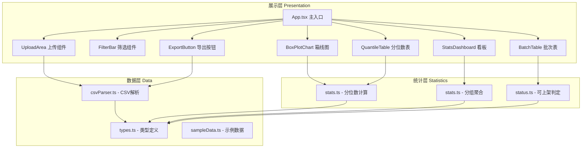
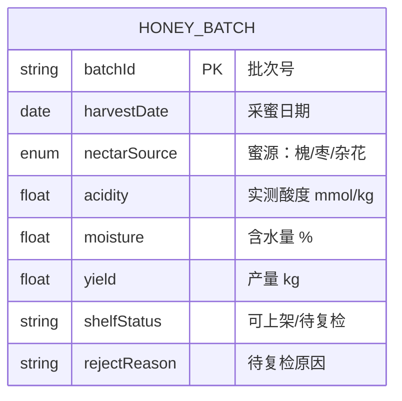

## 1. 架构设计



## 2. 技术说明

- **前端**：React@18 + TypeScript + Vite + TailwindCSS@3 + Zustand
- **状态管理**：Zustand 管理原始数据、筛选条件、派生数据
- **CSV 解析**：自研轻量解析器（支持 UTF-8/GBK、首行表头、逗号分隔）
- **图表**：纯 SVG 自绘箱线图（不引入第三方图表库，满足"简易图表达"要求）
- **无后端**：纯前端单页应用，所有计算在浏览器完成，Docker 仅托管静态资源
- **Docker**：多阶段构建，node:20-alpine 构建 → nginx:alpine 托管

## 3. 目录结构

```
src/
├── data/                    # 数据层
│   ├── types.ts             # 类型定义
│   ├── csvParser.ts         # CSV 解析与导出
│   └── sampleData.ts        # 示例数据生成
├── stats/                   # 统计层
│   ├── stats.ts             # 分位数、分组聚合
│   └── status.ts            # 可上架判定
├── components/              # 展示层
│   ├── UploadArea.tsx
│   ├── FilterBar.tsx
│   ├── StatsDashboard.tsx
│   ├── BoxPlotChart.tsx
│   ├── QuantileTable.tsx
│   └── BatchTable.tsx
├── store/                   # Zustand 状态
│   └── useDataStore.ts
├── App.tsx
├── main.tsx
└── index.css
```

## 4. 数据模型

### 4.1 数据模型定义



### 4.2 CSV 输入字段

| 列名 | 类型 | 必填 | 说明 |
|------|------|------|------|
| 批次号 | string | 是 | 唯一标识 |
| 采蜜日期 | date | 是 | YYYY-MM-DD 或 YYYY/MM/DD |
| 蜜源标注 | enum | 是 | 槐 / 枣 / 杂花 |
| 实测酸度 | number | 是 | mmol/kg，非负 |
| 含水量 | number | 是 | %，0-100 |
| 产量 | number | 是 | kg，非负 |

### 4.3 判定规则

- **可上架**：酸度 ≤ 40 且 含水量 ≤ 20%
- **待复检**：不满足以上任一条件
- **待复检原因**：
  - 酸度超标（酸度 > 40）
  - 含水量超标（含水量 > 20%）
  - 酸度与含水量均超标

## 5. 关键算法

### 5.1 分位数计算（Tukey 箱线图法）

- Q1 = 第 25 百分位数
- Q2 = 第 50 百分位数（中位数）
- Q3 = 第 75 百分位数
- IQR = Q3 - Q1
- 下界 = Q1 - 1.5 × IQR（不低于最小值）
- 上界 = Q3 + 1.5 × IQR（不高于最大值）
- 离群点：< 下界 或 > 上界

### 5.2 筛选联动逻辑

筛选条件变化 → Zustand 触发派生数据重算 → 所有订阅组件自动重渲染：
1. 先按月份区间过滤（采蜜日期月份 ∈ [起始月, 终止月]）
2. 再按蜜源多选过滤（蜜源 ∈ 选中集合）
3. 对过滤后的数据重新计算分组统计、分位数、状态分布
